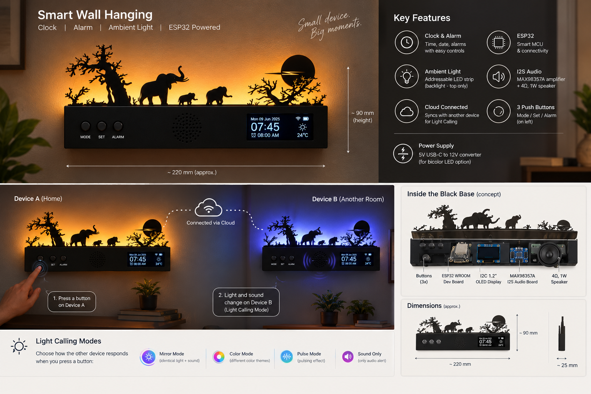

The following are the specification for the idea:

## Hardware (Electronics) needed per module

- ESP32 Wroom developement board
- I2C 1.2 inch OLED Display screen 
- I2S MAX98357A board
- 4 ohm, 1 W speaker
- ws2812b LED strip or MOSFET controlled bi-color LED strips (to be decided)
- 3 push buttons
- 5V USB C to 12V converter (powersupply) (if we are going for bicolor LEDs)

Inspired from , but it should also have an enclosing

The Basic idea is :

# Smart ESP32 Wall Clock — Software Architecture

## 1. High-Level Architecture

The system is divided into two major blocks:

1. **Edge Block** — Software running on the ESP32 device
2. **Cloud Block** — Cloud-hosted software for device management, synchronization, Light Calling, configuration, and OTA

## 3. Architecture: Block-Service-APIs

### 3.1 Block-Service-APIs Overview Table

| Block | Layer | Service | Key APIs |
|-------|-------|---------|----------|
| **EDGE** | Hardware Abstraction | Device Service | init() · getDeviceInfo() · getDeviceStatus() · factoryReset() |
| **EDGE** | Time Management | Clock Service | getTime() · syncTime() · setTimezone() · getDateTime() |
| **EDGE** | Alarm Management | Alarm Service | createAlarm() · updateAlarm() · deleteAlarm() · getAlarms() · enableAlarm() · disableAlarm() · triggerAlarm() |
| **EDGE** | Social Features | Light Calling Service | sendLightCall() · receiveLightCall() · setLightEffect() · setSoundEffect() · stopLightCall() |
| **EDGE** | Network Management | Wi-Fi Service | connect() · disconnect() · getStatus() · setCredentials() · startProvisioning() · clearCredentials() |
| **EDGE** | Cloud Connectivity | Cloud Connectivity Service | connectCloud() · disconnectCloud() · publishEvent() · subscribeEvent() · getConnectionStatus() |
| **EDGE** | User Interface | Display Service | showClock() · showAlarm() · showStatus() · showMessage() · clearDisplay() |
| **EDGE** | User Interface | Lighting Service | setBrightness() · setColor() · setEffect() · turnOn() · turnOff() |
| **EDGE** | User Interface | Audio Service | playSound() · stopSound() · setVolume() |
| **EDGE** | User Interface | Button Service | getButtonEvent() · registerCallback() |
| **EDGE** | System Management | Configuration Service | getConfig() · setConfig() · saveConfig() · resetConfig() |
| **EDGE** | System Management | OTA Service | checkUpdate() · getFirmwareInfo() · startUpdate() · getUpdateStatus() · rollback() |
| **CLOUD** | Frontend | Authentication Service | login() · logout() · refreshToken() · getUser() |
| **CLOUD** | Frontend | Device Dashboard Service | getDevices() · getDeviceStatus() · getDeviceInfo() |
| **CLOUD** | Frontend | Device Configuration Service | getConfiguration() · updateConfiguration() |
| **CLOUD** | Frontend | Clock Service | getClockConfig() · updateClockConfig() |
| **CLOUD** | Frontend | Alarm Service | getAlarms() · createAlarm() · updateAlarm() · deleteAlarm() |
| **CLOUD** | Frontend | Light Calling Service | sendLightCall() · configureLightCall() · getLightCallHistory() |
| **CLOUD** | Frontend | Wi-Fi Provisioning Service | startProvisioning() · updateWiFiConfig() |
| **CLOUD** | Frontend | Firmware Service | getFirmwareVersion() · checkForUpdate() · startOTA() · getUpdateStatus() |
| **CLOUD** | Frontend | User Settings Service | getSettings() · updateSettings() |
| **CLOUD** | Backend | Authentication Service | registerUser() · loginUser() · refreshToken() · validateToken() |
| **CLOUD** | Backend | Device Management Service | registerDevice() · getDevice() · getDevices() · updateDevice() · removeDevice() |
| **CLOUD** | Backend | Device Communication Service | sendCommand() · publishEvent() · getDeviceStatus() |
| **CLOUD** | Backend | Light Calling Service | sendLightCall() · routeLightCall() · getCallStatus() |
| **CLOUD** | Backend | Alarm Configuration Service | getAlarms() · createAlarm() · updateAlarm() · deleteAlarm() · syncAlarm() |
| **CLOUD** | Backend | Device Configuration Service | getConfig() · updateConfig() · syncConfig() |
| **CLOUD** | Backend | MQTT Service | publish() · subscribe() · connectDevice() · disconnectDevice() |
| **CLOUD** | Backend | OTA Service | getLatestFirmware() · createUpdate() · getUpdateStatus() · publishFirmware() |
| **CLOUD** | Backend | User Service | createUser() · getUser() · updateUser() |
| **CLOUD** | Backend | Device Registry Service | register() · authenticateDevice() · getDeviceMetadata() · updateDeviceStatus() |
| **CLOUD** | Backend | Telemetry Service | publishTelemetry() · getTelemetry() |
| **CLOUD** | Backend | Database Service | read() · write() · update() · delete() |

## 4. Communication Protocol Diagram

```plantuml
@startuml ESP32-Cloud-Architecture

!define EDGE_COLOR #FF6B6B
!define CLOUD_BACKEND_COLOR #4ECDC4
!define CLOUD_FRONTEND_COLOR #95E1D3
!define PROTOCOL_COLOR #FFE66D

' Actors
actor User

' Edge Block (ESP32)
rectangle "EDGE BLOCK (ESP32)" #FF6B6B {
    package "Services" {
        component "Device Service" as ES_Device
        component "Clock Service" as ES_Clock
        component "Alarm Service" as ES_Alarm
        component "Light Calling Service" as ES_LightCall
        component "Wi-Fi Service" as ES_WiFi
        component "Cloud Connectivity Service" as ES_Cloud
        component "Display Service" as ES_Display
        component "Lighting Service" as ES_Lighting
        component "Audio Service" as ES_Audio
        component "Button Service" as ES_Button
        component "Configuration Service" as ES_Config
        component "OTA Service" as ES_OTA
    }
}

' Cloud Frontend
rectangle "CLOUD BLOCK - FRONTEND" #95E1D3 {
    component "Dashboard UI" as CF_Dashboard
    component "Device Manager" as CF_DeviceManager
    component "Alarm Manager" as CF_AlarmManager
    component "Light Call Manager" as CF_LightCallManager
    component "Firmware Manager" as CF_FirmwareManager
    component "Settings Manager" as CF_Settings
}

' Cloud Backend
rectangle "CLOUD BLOCK - BACKEND" #4ECDC4 {
    package "Services" {
        component "Auth Service" as CB_Auth
        component "Device Management" as CB_DevMgmt
        component "Device Communication" as CB_DevComm
        component "Light Call Router" as CB_LightRouter
        component "Alarm Manager" as CB_AlarmMgr
        component "Config Manager" as CB_ConfigMgr
        component "OTA Manager" as CB_OTAMgr
        component "Telemetry" as CB_Telemetry
    }
    
    database "Database" as CB_DB
}

' User Interactions
User --> CF_Dashboard : Browser/App
User --> CF_DeviceManager : HTTP/HTTPS
User --> CF_AlarmManager : HTTP/HTTPS
User --> CF_LightCallManager : HTTP/HTTPS
User --> CF_Settings : HTTP/HTTPS

' Frontend to Backend (REST API)
CF_Dashboard --> CB_Auth : REST API
CF_Dashboard --> CB_DevMgmt : REST API
CF_Dashboard --> CB_DevComm : REST API
CF_DeviceManager --> CB_DevMgmt : REST API
CF_AlarmManager --> CB_AlarmMgr : REST API
CF_LightCallManager --> CB_LightRouter : REST API
CF_FirmwareManager --> CB_OTAMgr : REST API
CF_Settings --> CB_Auth : REST API

' Backend to Database
CB_Auth --> CB_DB : SQL Queries
CB_DevMgmt --> CB_DB : SQL Queries
CB_AlarmMgr --> CB_DB : SQL Queries
CB_Telemetry --> CB_DB : SQL Queries

' Edge to Backend - MQTT (Real-time Communication)
ES_Cloud -.->|MQTT Subscribe| CB_DevComm : Commands, Config, OTA
CB_DevComm -.->|MQTT Publish| ES_Cloud : Status, Telemetry, Alarms
ES_LightCall -.->|MQTT Publish| CB_LightRouter : Light Call Events
CB_LightRouter -.->|MQTT Publish| ES_LightCall : Incoming Light Calls
ES_OTA -.->|MQTT Publish| CB_OTAMgr : Update Status
CB_OTAMgr -.->|MQTT Publish| ES_OTA : Firmware Updates
ES_Alarm -.->|MQTT Publish| CB_AlarmMgr : Alarm Triggers
CB_AlarmMgr -.->|MQTT Publish| ES_Alarm : Alarm Sync

' Edge to Backend - REST API (Config & Management)
ES_Config -->|REST API| CB_ConfigMgr : Sync Config
ES_Device -->|REST API| CB_DevMgmt : Register/Update Device
ES_OTA -->|REST API| CB_OTAMgr : Check Firmware Version

' Edge to Internet Services
ES_Clock -->|NTP Request| User : Time Synchronization
ES_WiFi -->|DNS/DHCP| User : Network Setup

' Internal Edge Communications (Internal Bus)
ES_Button --> ES_Alarm : Button Events
ES_Button --> ES_LightCall : Button Events
ES_Button --> ES_Config : Button Events
ES_Alarm --> ES_Audio : Trigger Sound
ES_Alarm --> ES_Display : Show Alarm
ES_LightCall --> ES_Lighting : Set LED Effects
ES_LightCall --> ES_Audio : Set Sound Effect
ES_Device --> ES_Display : Device Status
ES_Config --> ES_OTA : Firmware Config
ES_Cloud --> ES_Telemetry : Event Publishing

note right of ES_Cloud
    MQTT: Real-time bidirectional communication
    Topics: device/{id}/command, device/{id}/status, 
            device/{id}/alarm, device/{id}/lightcall
end note

note right of CB_DevComm
    Routes MQTT messages to appropriate 
    backend services for processing
end note

note right of CF_Dashboard
    User-facing interface for device
    management and monitoring
end note

legend right
    |<#FFE66D> REST API (Stateless, Configuration) |
    |<#90EE90> MQTT (Real-time, Event-driven) |
    |<#CCCCCC> Internal Services Communication |
end legend

@enduml
```

## 5. Communication Protocols

| Protocol | Purpose | Direction | Use Case |
|----------|---------|-----------|----------|
| **MQTT** | Real-time device communication | Bidirectional | Light Calling, Commands, Status Updates, Alarms, Telemetry |
| **REST API** | Configuration & Management | Request/Response | Device registration, Config sync, Alarm management, OTA checks |
| **NTP** | Time Synchronization | Request/Response | Clock synchronization with internet |
| **HTTPS** | Frontend-Backend Communication | Request/Response | User authentication, Dashboard queries, Settings management |
| **Internal Bus** | Inter-service communication on Edge | Bidirectional | Button events, Display updates, Audio playback coordination |

This is a good service/API boundary definition to use before deciding the actual implementation technologies.